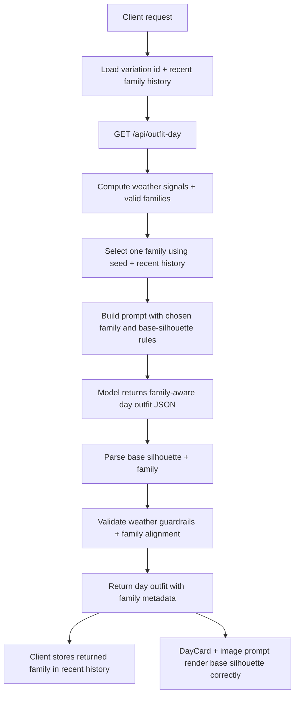

# Add day-mode outfit family variation

## Overview

Day mode needs two things at once: a more flexible outfit representation and a deliberate variation mechanism. The current `top + bottom + layer + shoes` contract keeps nudging the model toward the same polished separates answer, and prompt-only nudges have already hit their ceiling. This plan introduces a day-mode base-silhouette schema plus enforceable outfit-family selection so the system can vary the shape of the answer across users and days without devolving into random garment combinations.

## Problem Frame

The upstream brainstorm established that the real product problem is not just "why no dresses?" It is that day mode cannot represent different base silhouettes cleanly, and it has no system-owned way to create meaningful variation when weather repeats. That leads to two failures: the model keeps collapsing back to the same safe family, and two users in the same city can easily get near-clone outfits (see origin: `docs/brainstorms/2026-04-14-outfit-family-variation-brainstorm.md`).

The chosen direction is:

- make base silhouette first-class in day mode
- make outfit family a first-class internal constraint, not just a prompt hint
- choose a valid family with seeded variation plus lightweight anti-repetition
- let the model style within that chosen family

Creator mode stays out of scope for this first implementation so the plan can prove the concept without inventory/indexing complexity.

## Requirements Trace

- R1. Day mode must support a flexible base silhouette instead of forcing every outfit through `top + bottom`.
- R2. Day mode must select from a valid set of outfit families for the weather/context rather than leaving silhouette variation entirely to the model.
- R3. The chosen outfit family must be enforceable in the prompt, parser, and validator, not only suggested in prose.
- R4. Anonymous users must get meaningful day-to-day and user-to-user variation without requiring account-level identity.
- R5. Recent day-mode family choices should influence future selection enough to reduce obvious repetition.
- R6. Day-mode UI, share text, and image generation must correctly represent both dress-based and separates-based outfits.
- R7. Creator mode, creator contracts, and creator UI are explicitly out of scope for this pass.

## Scope Boundaries

- In scope:
  - Day-mode API contract changes
  - Day-mode prompt, parser, validation, and guardrail updates
  - Day-mode client plumbing for anonymous variation identity and recent family history
  - Day-mode UI/rendering and image prompt updates
  - Deterministic benchmark/debug output for family selection review
- Out of scope:
  - Creator-mode schema or response-shape changes
  - Creator candidate-set reshaping
  - Trip packing-list logic
  - User accounts or server-side persistence for variation identity/history
  - Full wardrobe personalization or occasion modeling

## Context & Research

### Relevant Code and Patterns

- `src/lib/types.ts` and `src/lib/ai-shapes.ts` currently define and parse day outfits as fixed `top`, `layer`, `bottom`, and `shoes` fields.
- `src/app/api/outfit-day/route.ts` already owns the day-mode prompt/parse/retry/guardrail loop and is the natural place to select and enforce a day-mode outfit family.
- `src/lib/outfit-prompt.ts` already centralizes day-mode prompt composition, signal-brief formatting, and hot-weather preference language.
- `src/lib/outfit-output-guardrails.ts` already validates day-mode weather constraints and is the natural place for family-alignment checks.
- `src/components/day-card.tsx`, `src/hooks/use-outfit-image.ts`, and `src/app/api/outfit-image/route.ts` all assume the old slot-based day outfit shape and will need coordinated updates.
- `src/app/app/page.tsx` is the current home of day-mode fetch calls and is the right place to thread anonymous variation headers/history into `/api/outfit-day`.
- `tests/outfit-day-prompt.test.ts`, `tests/outfit-output-guardrails.test.ts`, `tests/outfit-benchmark-fixture.test.ts`, and `tests/smoke.spec.ts` already cover the surrounding day-mode behavior and can be extended instead of inventing a new test posture.

### Institutional Learnings

- No `docs/solutions/` directory exists in this repo right now, so the main prior art is the brainstorm and prior outfit plans from `docs/brainstorms/` and `docs/plans/`.

### External References

- None. The local codebase provides enough prompt, route, and rendering patterns for this bounded day-mode-first pass.

## Key Technical Decisions

- **Day mode gets the new schema first.** Creator mode remains unchanged so the first implementation can prove the architecture without candidate-index complexity.
- **Outfit family becomes an internal response field.** Day-mode outfits should carry a first-class `family` so the route can validate it, the client can remember it, and benchmarks can inspect it, even if the visible UI never renders it.
- **Base silhouette is a discriminated union.** For v1 the day-mode base should support `separates` and `dress`; broader one-piece abstractions can wait.
- **Family selection is server-owned, but identity/history is client-supplied.** The client should provide an anonymous persistent variation id plus recent family history; the server should use that context to choose a valid family deterministically for the current request.
- **Anti-repetition should stay lightweight.** Remember the last 3 family choices in local storage and downweight or exclude them when similar alternatives are valid; do not add server persistence.
- **Validation should enforce family alignment semantically, not literally by prompt wording.** If the route selects `easy_dress`, the parsed outfit should not come back as trouser separates and still pass just because the prompt mentioned dresses.
- **Benchmark/debug output should expose family selection.** This is needed to review whether the system actually varies by family instead of only changing prompt phrasing.
- **Image caching must distinguish silhouette/family changes.** The current day-image cache key is too coarse once the same date/location can produce different valid families.

## Open Questions

### Resolved During Planning

- **How should anonymous variation be seeded?** Use a client-generated persistent variation id stored locally and sent with day-mode requests.
- **How much recent family history should we remember?** Start with the last 3 day-mode family choices only.
- **Should family be visible for review?** Yes, in API/benchmark/debug output; no, in normal UI rendering.
- **Should creator mode adopt the same schema now?** No. Keep creator mode out of scope for this plan.

### Deferred to Implementation

- The exact weighting table between valid families for each weather/context bucket, as long as it clearly deprioritizes repeated recent families and preserves obvious weather constraints.
- Whether recent-family avoidance is implemented as a hard exclusion when alternatives exist or as a scoring penalty, as long as the behavior is deterministic and reviewable.
- The exact name and placement of the anonymous variation headers or request fields, as long as they stay internal to `/api/outfit-day`.

## High-Level Technical Design

> *This illustrates the intended approach and is directional guidance for review, not implementation specification. The implementing agent should treat it as context, not code to reproduce.*

## Implementation Units

- [ ] **Unit 1: Introduce day-mode family and base-silhouette contract**

**Goal:** Replace the old fixed-slot day-mode body contract with a family-aware base silhouette that can represent both separates and dresses cleanly.

**Requirements:** R1, R3

**Dependencies:** None

**Files:**
- Modify: `src/lib/types.ts`
- Modify: `src/lib/ai-shapes.ts`
- Modify: `src/lib/outfit-prompt.ts`
- Test: `tests/outfit-day-prompt.test.ts`
- Test: `tests/outfit-family-selection.test.ts`

**Approach:**
- Add a day-mode family enum/type covering the initial family set needed for day mode.
- Add a discriminated `base` silhouette for day-mode walk-out output:
  - `separates` with `top` + `bottom`
  - `dress` with `dress`
- Include a first-class `family` field in the day-mode response contract so the selected family survives parsing and can be stored by the client.
- Update the day-mode prompt contract so the model must return `family` plus the new `base` shape, while preserving the existing carry/evening/bag structure.
- Keep creator types and creator parsing unchanged.

**Execution note:** Start with a failing contract test for the new day-mode shape before changing prompt text.

**Patterns to follow:**
- Existing runtime validation style in `src/lib/ai-shapes.ts`
- Existing prompt-contract assertions in `tests/outfit-day-prompt.test.ts`

**Test scenarios:**
- Happy path: a separates-based day outfit with `family` parses successfully into the new day-mode type.
- Happy path: a dress-based day outfit with `family` parses successfully and does not require `top`/`bottom`.
- Edge case: malformed mixed states such as `base.kind="dress"` with `top`/`bottom` present are rejected.
- Edge case: malformed mixed states such as `base.kind="separates"` without both `top` and `bottom` are rejected.
- Error path: missing or unknown `family` values are rejected clearly.
- Integration: day-mode prompt text requires the model to return `family` and the new `base` structure.

**Verification:**
- Day-mode JSON can legally represent both dress and separates looks, and invalid mixed states are rejected at parse time.

- [ ] **Unit 2: Select and enforce day-mode outfit family in the route**

**Goal:** Make day mode choose a valid outfit family for the day, prompt the model inside that lane, and reject outputs that drift outside it.

**Requirements:** R2, R3, R4, R5

**Dependencies:** Unit 1

**Files:**
- Create: `src/lib/outfit-family.ts`
- Modify: `src/app/api/outfit-day/route.ts`
- Modify: `src/lib/outfit-prompt.ts`
- Modify: `src/lib/outfit-output-guardrails.ts`
- Test: `tests/outfit-family-selection.test.ts`
- Test: `tests/outfit-output-guardrails.test.ts`
- Test: `tests/outfit-day-route.test.ts`

**Approach:**
- Add a shared day-mode family helper module that:
  - derives valid families from weather/context
  - selects one family deterministically from a seed plus recent-history input
  - exposes a semantic matcher that can check whether a returned outfit stayed in-family
- Update `/api/outfit-day` to read anonymous variation context from the request, derive valid families, choose one family, and pass it into prompt building.
- Update prompt composition so the selected family is explicit and the model is asked to style within that family rather than choose any silhouette it wants.
- Extend guardrail validation to check family alignment as well as weather constraints, including free-text note/summary fields so disallowed family drift cannot hide in prose.
- Keep the existing retry/sanitization behavior, but only when it does not break the selected family.

**Patterns to follow:**
- Existing signal-brief and guardrail loop in `src/app/api/outfit-day/route.ts`
- Existing validator style in `src/lib/outfit-output-guardrails.ts`

**Test scenarios:**
- Happy path: a hot-weather request selects a dress family and accepts a matching dress outfit.
- Happy path: a warm-weather request selects a separates family and accepts a matching separates outfit.
- Edge case: recent-family history causes the selector to choose a different valid family when multiple valid options exist.
- Edge case: when only one valid family exists, recent history does not force an invalid alternative.
- Error path: the model returns a separates outfit when `easy_dress` was selected and the route rejects or retries it as out-of-family.
- Error path: the model returns a dress when a separates-only family was selected and validation catches the mismatch.
- Integration: weather guardrails and family-alignment checks both run on the same parsed output without conflicting.

**Verification:**
- `/api/outfit-day` chooses one valid family per request, prompts inside it, and enforces that family in the returned outfit.

- [ ] **Unit 3: Add anonymous variation identity and recent-family history on the client**

**Goal:** Give day-mode requests stable anonymous variation context so the server can vary outputs across users and reduce repetition for the same user.

**Requirements:** R4, R5

**Dependencies:** Unit 2

**Files:**
- Create: `src/lib/outfit-family-client.ts`
- Modify: `src/app/app/page.tsx`
- Modify: `src/lib/api-fetch.ts`
- Test: `tests/outfit-family-client.test.ts`
- Test: `tests/outfit-day-route.test.ts`

**Approach:**
- Add a small client-side helper that:
  - creates/reads a persistent anonymous variation id from local storage
  - reads/writes a short recent-family history list
  - serializes that context into day-mode request metadata
- Thread that metadata into day-mode fetches only (`today` and trip drill-down day fetches), leaving other API calls untouched.
- On a successful day-mode response, store the returned `family` in recent history for future requests.
- Keep the helper isolated so it can be tested with an injected storage-like object rather than tying tests to real browser APIs.

**Patterns to follow:**
- Existing client fetch orchestration in `src/app/app/page.tsx`
- Existing API helper structure in `src/lib/api-fetch.ts`

**Test scenarios:**
- Happy path: first run creates a stable anonymous variation id and sends it with day-mode requests.
- Happy path: successful day-mode responses append the returned family to recent history.
- Edge case: history is capped to the last 3 families and drops older entries.
- Edge case: malformed stored history is ignored/reset instead of breaking the request flow.
- Integration: trip drill-down day requests send the same variation context as normal day-mode requests.

**Verification:**
- Repeated day-mode requests carry stable anonymous variation context and recent family history without affecting non-day API calls.

- [ ] **Unit 4: Adapt day-mode rendering, sharing, and image prompts to the new silhouette model**

**Goal:** Make the UI and image-generation path correctly display and describe either a dress-based or separates-based day outfit.

**Requirements:** R6

**Dependencies:** Unit 1, Unit 2

**Files:**
- Modify: `src/components/day-card.tsx`
- Modify: `src/hooks/use-outfit-image.ts`
- Modify: `src/app/api/outfit-image/route.ts`
- Modify: `src/app/docs/page.tsx`
- Test: `tests/outfit-image-prompt.test.ts`
- Test: `tests/smoke.spec.ts`

**Approach:**
- Update `DayCard` so the morning rows render according to the base silhouette:
  - dress row for dress-based looks
  - top/bottom rows for separates-based looks
- Update share text generation so the summary reads naturally for either silhouette.
- Refactor image prompt construction enough that it can describe the new base silhouette cleanly and deterministically for both variants.
- Update day-image cache identity so two valid outfits for the same location/date do not reuse the wrong cached image just because the headline matches.
- Update docs/examples that reference the old slot-only day contract.

**Patterns to follow:**
- Existing row rendering in `src/components/day-card.tsx`
- Existing outfit-image prompt construction in `src/app/api/outfit-image/route.ts`

**Test scenarios:**
- Happy path: a separates-based day result still renders the expected morning rows and share text.
- Happy path: a dress-based day result renders a dress row instead of fake top/bottom rows.
- Edge case: `layer=null` still renders cleanly for both silhouette variants.
- Edge case: image-cache identity changes when family/base silhouette changes for the same date/location so a new family does not reuse an old image.
- Integration: the image prompt includes the dress description for dress-based outfits and the top/bottom pair for separates-based outfits.
- Integration: the app smoke flow still renders a day result after the contract change.

**Verification:**
- Day-mode UI, share text, and image prompts all represent the selected silhouette correctly without depending on the old fixed-slot assumptions.

- [ ] **Unit 5: Extend benchmark and review tooling for family-aware day-mode debugging**

**Goal:** Make it easy to inspect family selection and family adherence during deterministic prompt review and manual live checks.

**Requirements:** R3, R4, R5

**Dependencies:** Unit 2, Unit 3

**Files:**
- Modify: `tests/fixtures/outfit-benchmark-queries.json`
- Modify: `scripts/review-outfit-benchmarks.ts`
- Modify: `tests/outfit-benchmark-fixture.test.ts`
- Test: `tests/outfit-benchmark-fixture.test.ts`
- Test: `tests/outfit-family-selection.test.ts`

**Approach:**
- Add family-aware fixture metadata so benchmark scenarios can specify the expected valid family set, fixed variation inputs, or intended review focus.
- Extend the benchmark review output to include selected family and the fixed variation/debug fields needed to inspect deterministic family-selection behavior.
- Keep benchmark tooling deterministic and review-oriented; do not turn it into a scoring engine.

**Patterns to follow:**
- Existing deterministic benchmark fixture flow in `tests/fixtures/outfit-benchmark-queries.json`
- Existing review snapshot script in `scripts/review-outfit-benchmarks.ts`

**Test scenarios:**
- Happy path: benchmark fixtures still parse after adding family-aware metadata.
- Happy path: generated review snapshots include the selected family/debug info for day-mode scenarios.
- Edge case: benchmark output remains deterministic for the same variation id, recent-family history, and scenario input.
- Integration: hot-weather benchmark scenarios expose whether the system selected dress, skirt, shorts, or trouser families as intended.

**Verification:**
- Reviewers can see which family was selected for a benchmark scenario and verify that the output stayed in that lane.

## System-Wide Impact

- **Interaction graph:** `src/app/app/page.tsx` day-mode requests feed `/api/outfit-day`, which now must coordinate family selection, prompt construction, parsing, validation, and client-side history updates. Day results also flow into `DayCard` and `/api/outfit-image`.
- **Error propagation:** Family mismatch becomes a first-class validation failure alongside existing weather guardrails; retry/sanitization behavior must not accidentally erase the chosen family.
- **State lifecycle risks:** Anonymous variation id and recent family history are new client-side persistent state. Corrupt or missing local storage should degrade gracefully to a fresh identity/history, not break search.
- **API surface parity:** Day-mode API shape changes; creator and trip packing-list shapes remain unchanged. Trip drill-down day fetches must stay compatible because they reuse `/api/outfit-day`.
- **Integration coverage:** The important cross-layer path is client variation context -> route family selection -> parsed day result with family -> client history update -> rendering/image prompt. That needs integration-minded tests, not only isolated unit tests.
- **Unchanged invariants:** Existing day-mode carry/evening/bag behavior, creator mode contracts, and creator UI remain intact. This plan changes only day-mode silhouette/family representation and day-mode variation behavior.

## Risks & Dependencies

| Risk | Mitigation |
|------|------------|
| Family selection exists but the model still drifts outside it | Enforce `family` in the parser/validator and treat mismatch as a first-class failure |
| Anonymous variation data leaks into unrelated API calls or becomes brittle | Isolate the client helper and thread it only into day-mode fetches |
| Schema changes break existing day-card rendering or image prompts | Land rendering/image updates in the same plan and cover both dress and separates variants |
| Anti-repetition logic makes results feel forced or chaotic | Keep history short, only downweight repeated valid families, and preserve deterministic review output |

## Documentation / Operational Notes

- Update day-mode API examples in `src/app/docs/page.tsx` to reflect the new family/base silhouette response shape.
- Manual spot checks should include repeated similar-weather searches from fresh/incognito contexts to verify user-to-user variation and repeated searches from the same browser to verify anti-repetition.

## Sources & References

- **Origin document:** `docs/brainstorms/2026-04-14-outfit-family-variation-brainstorm.md`
- Related plan: `docs/plans/2026-04-14-002-feat-hot-weather-silhouette-preference-plan.md`
- Related code: `src/app/api/outfit-day/route.ts`
- Related code: `src/lib/outfit-prompt.ts`
- Related code: `src/lib/outfit-output-guardrails.ts`
- Related code: `src/components/day-card.tsx`
- Related code: `src/app/api/outfit-image/route.ts`
